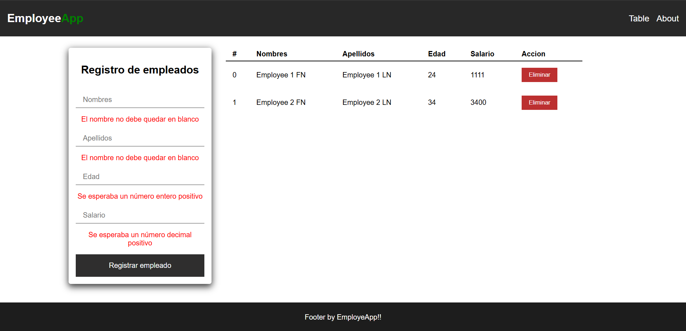
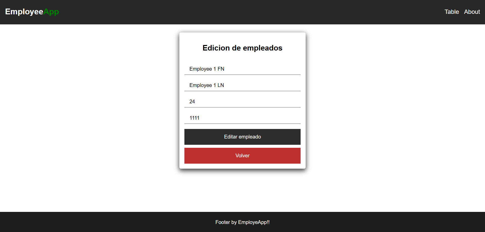

# Employee Management App V1

This is a **full-stack employee management application** built with **Angular** as the frontend and supports **two interchangeable backends**: one using **Django** and another using **Express.js**. The backend can be switched by modifying a variable in the frontend employee service.

## 🚀 Features
- **Interoperable Backend**: Choose between Django or Express.js.
- **Employee CRUD Operations**: Create, Read, Update, Delete employees.
- **RESTful API**: Fetch data from the selected backend.
- **Responsive UI**: Built with Angular components.
- **Modular Architecture**: Clean and maintainable codebase.

## 🛠 Tech Stack
### **Frontend**
- **Framework**: Angular
- **State Management**: Services
- **Routing**: Angular Router
- **Styling**: CSS

### **Backend (Django Option)**
- **Framework**: Django REST Framework (DRF)
- **Database**: SQLite
- **Serialization**: Django Serializers

### **Backend (Express.js Option)**
- **Framework**: Express.js
- **Database**: MongoDB (or another supported DB via Mongoose)
- **Validation**: Middleware & Validators

## 📦 Installation
### **1️⃣ Clone the repository**
```sh
git clone https://github.com/your-username/employee-app.git
cd employee-app
```

### **2️⃣ Set up the backend**
#### **Django Backend**
```sh
cd Backend
python -m venv myenv
./myenv/Scripts/activate
pip install -r requirements.txt
python manage.py migrate
python manage.py runserver
```

#### **Express.js Backend**
```sh
cd Backend_Express
npm install
npm start
```

### **3️⃣ Set up the frontend**
```sh
cd Frontend
npm install
ng serve
```

## 🔄 Switching Backend
Modify the **employee service** in the Angular project (`employee-service.service.ts`) to select the appropriate API URL:
```ts
const API_URL = 'http://localhost:8000/api/employees'; // Django backend
// const API_URL = 'http://localhost:3000/api/employees'; // Express backend
```

## 📂 Project Structure
```
EmployeeApp/
│── Backend/  (Django Backend)
│── Backend_Express/  (Express.js Backend)
│── Frontend/  (Angular Frontend)
```

## 📸 Preview
### Employee List


### Employee Details


## 📜 License
This project is licensed under the **MIT License**. Feel free to use and modify it!